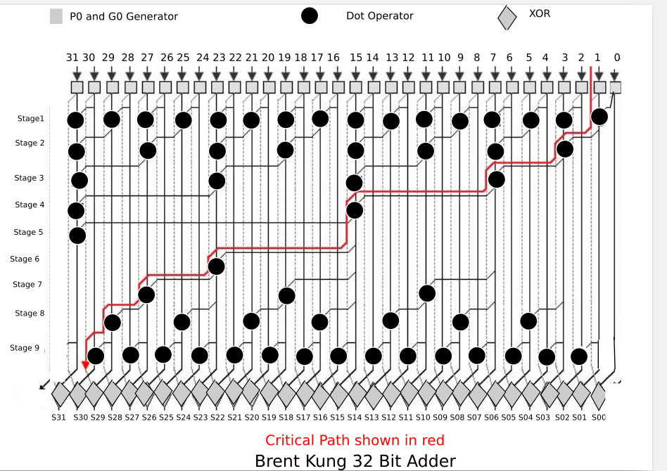

# 32-bit-Brent-Kung-architecture
Brent Kung architecture for adding 32 bit operands.

 
VHDL implementation of logarithmic adder using Brent Kung achitecture for adding 32 bit operands.

It has log2N levels of logic making it a fast adder.

It has low gate count, used for low power applications

Goto [Documentation](https://github.com/sourabh-suri/32-bit-Brent-Kung-architecture/blob/master/Documentation.pdf) for all details.....
