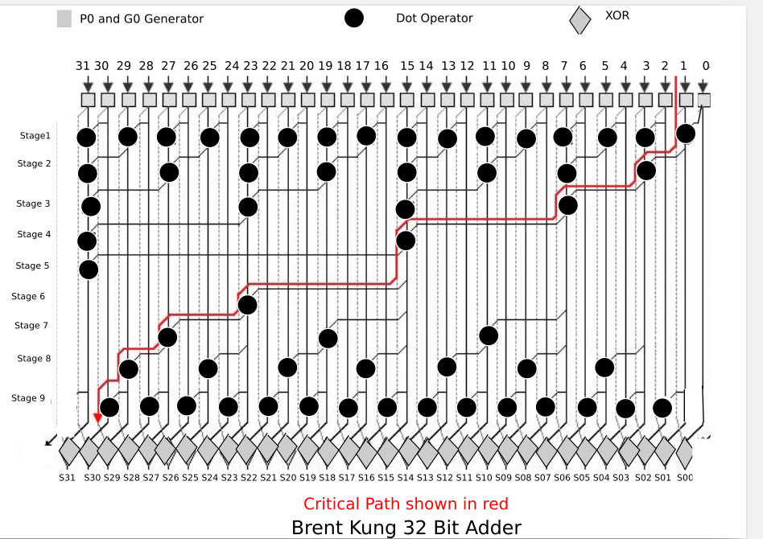

# 32-bit-Brent-Kung-architecture
Brent Kung architecture for adding 32 bit operands.
VHDL implementation of logarithmic adder using Brent Kung achitecture for adding 32 bit operands.

Goto [Documentation](https://github.com/sourabh-suri/VLSI-Logical-Effort-/blob/master/Documentation.pdf) for all details.....
